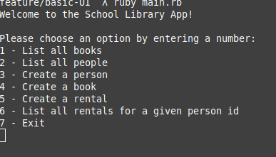
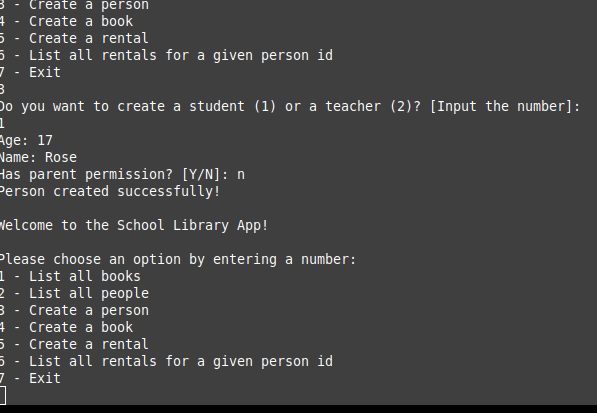
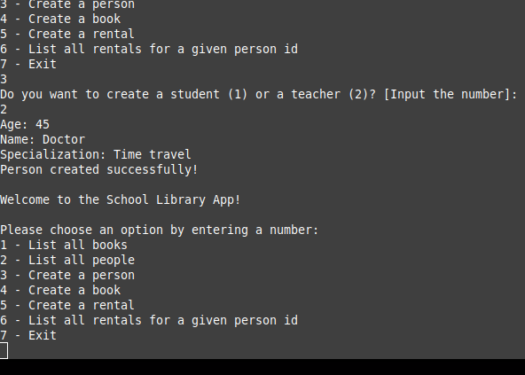
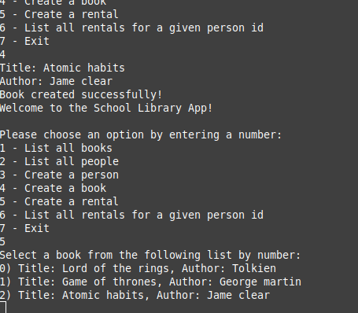

# OOP school library

> This project consists of Ruby script for the school library app. I implemented encapsulation and inheritance with Ruby by creating classes to represent students and teachers in the school.
## Class Diagram
> 


## Built With

- Ruby
- Bubocop


## Getting Started

**To get a local copy up and running follow these simple example steps.**

### Prerequisites
- Ruby should be installed on your machine

### Setup
```
git clone https://github.com/Mwapsam/OOP-school-library.git
cd OOP-school-library
```
### Install
```
bundle install
```

### Play with the code
```
irb
```

### Run linters
```
rubocop -a
```

### Run App
```
ruby app.rb
```

## Screenshots

> |Screenshot 1|Screenshots 2|
> |--------------|----------------|
> |||!
> |Screenshot 3|Screenshots 4|
> |--------------|----------------|
> |||!


## 👤Author

- GitHub: [@mwapsam](https://github.com/Mwapsam)
- Twitter: [@mwapesamuel4](https://twitter.com/mwapesamuel4)
- LinkedIn: [mwapsam](https://www.linkedin.com/in/mwapsam/)


## 🤝 Contributing

Contributions, issues, and feature requests are welcome!

Feel free to check the [issues page](../../issues/).

## Show your support

Give a ⭐️ if you like this project!

## Acknowledgments

- Many thanks to Microverse

## 📝 License

This project is [MIT](./MIT.md) licensed.
